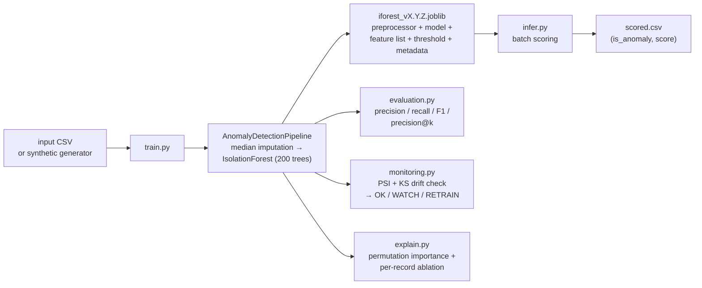
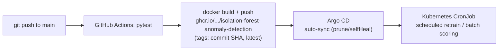

# isolation-forest-anomaly-detection

Production-style anomaly detection with scikit-learn's `IsolationForest`,
packaged the way real ML teams ship it: config-driven, one serialized
artifact, calibrated threshold, evaluation, per-record explainability, and
drift monitoring — with CI/CD, Docker, and a Helm + Argo CD GitOps
deployment.

**Method, honestly stated:** this is the approach I shipped at Honeywell for
industrial anomaly detection — Isolation Forest over multivariate equipment
telemetry (temperature, pressure, vibration, motor current, flow rate),
flagging rising vibration, temperature drift, unusual pressure behavior, and
combined sensor deviations as early indicators of equipment degradation.
This repo is a **reproducible reference implementation**: it trains on a
bundled synthetic labeled dataset so the full loop runs end-to-end without
proprietary data. Point it at real telemetry with `train.py --csv`.

> **No invented numbers:** every metric below was measured by running the
> code on 2026-09-23. No AUC or business-impact figure is claimed — those
> belong to the production deployment, not this reference repo.

## Architecture



Delivery:



## Measured results

Measured 2026-09-23 on this machine, training on the bundled synthetic
dataset (`make_synthetic_transactions`: 10,000 normal + 200 anomalous rows,
seed 42; labels used for evaluation only — the model never trains on them):

| Metric | Value |
|---|---|
| pytest suite | **7/7 passed** (8.3s) |
| Precision (synthetic labels) | **0.9804** |
| Recall (synthetic labels) | **1.0000** |
| F1 (synthetic labels) | **0.9901** |
| Average precision (synthetic labels) | **1.0000** |
| Precision@100 (synthetic labels) | **1.0000** |
| Flag rate @ contamination=0.02 | 0.0200 (204 flagged / 200 true) |
| Calibrated threshold | 0.6086 |
| Top drivers (permutation importance) | amount 0.68, distance_km 0.31 |

Serialization round-trip is exact (save → load reproduces identical scores),
and the drift check correctly flags a 10x distribution shock on `amount` as
`WATCH`/`RETRAIN`.

## Setup

```bash
pip install -r requirements.txt   # scikit-learn, pandas, numpy, joblib, scipy, pytest
```

## Usage

```bash
# 1. Train on synthetic data (or --csv your_telemetry.csv)
PYTHONPATH=src python train.py

# 2. Train on your own data
PYTHONPATH=src python train.py --csv telemetry.csv --contamination 0.02 --version 1.1.0

# 3. Batch-score new data with a trained artifact
PYTHONPATH=src python infer.py --model artifacts/iforest_v1.0.0.joblib \
    --csv new_telemetry.csv --out scored.csv

# 4. Run the test suite
PYTHONPATH=src pytest tests/ -v
```

### How it is used in production

1. **Train** on a representative window of historical telemetry (`train.py`).
2. **Ship one artifact** (`iforest_vX.Y.Z.joblib`) containing preprocessing,
   model, feature list, calibrated threshold and metadata — inference loads
   exactly this, so train/serve skew is impossible by construction.
3. **Score** in batch (`infer.py`), on a schedule (see `k8s/`), or load the
   artifact inside an API for real-time scoring.
4. **Monitor**: compare production anomaly-score distribution to the
   training baseline with `drift_check`. Verdict `RETRAIN` → refit.
5. **Explain** every flag: `explain_one_record` shows which feature values
   drove the decision (required for analyst/SOC workflows).

### Setting `contamination`

`contamination` is not learned — it is a business input: the share of
traffic you can afford to investigate. Start from historical incident rates,
then tune the operating threshold with `threshold_tradeoff()` against
labeled data until alert volume matches analyst capacity.

## Deployment

**Docker:**

```bash
docker build -t isolation-forest-anomaly-detection .
# Trains on the bundled synthetic data and prints the evaluation report:
docker run --rm isolation-forest-anomaly-detection
# Score your own CSV (mount it in):
docker run --rm -v $PWD/data:/data isolation-forest-anomaly-detection \
    python infer.py --model artifacts/iforest_v1.0.0.joblib --csv /data/telemetry.csv --out /data/scored.csv
```

**Helm + Argo CD (GitOps):** `k8s/helm/isolation-forest/` is a Helm chart
deploying the pipeline as a Kubernetes **CronJob** (batch workload —
retraining / batch scoring on a schedule; there is intentionally no
`Service`, since this repo ships CLIs, not an HTTP API), plus a
`ServiceAccount` and a `ConfigMap` for runtime settings.
`k8s/argocd/application.yaml` is the Argo CD entrypoint (automated sync
with prune + selfHeal).

```bash
helm lint --strict k8s/helm/isolation-forest
helm template isolation-forest k8s/helm/isolation-forest --namespace ml-batch
```

**CI/CD** (`.github/workflows/ci.yml`): on every push to `main` and every
pull request, CI runs the pytest suite. On merge to `main`, the `publish`
job builds the Docker image and pushes it to
`ghcr.io/SaiMudunuri04/isolation-forest-anomaly-detection` (tags: commit
SHA and `latest`) using `GITHUB_TOKEN` — no extra secrets. Argo CD then
syncs the new image.

Manifests are validated with `helm lint` / `helm template` and a
client-side structural check; they have not been applied to a live cluster.

## Project structure

```
isolation-forest-anomaly-detection/
├── src/iforest/
│   ├── config.py       # ModelConfig: every hyperparameter in one immutable place
│   ├── data.py         # synthetic data generator + CSV loader
│   ├── pipeline.py     # AnomalyDetectionPipeline: fit / score / predict / save / load
│   ├── evaluation.py   # precision/recall/F1, precision@k, threshold tradeoff curve
│   ├── monitoring.py   # PSI + KS drift check on score distributions
│   └── explain.py      # global permutation importance + per-record ablation
├── train.py            # training CLI
├── infer.py            # batch-scoring CLI
├── tests/              # pytest contract tests (7/7 passing)
├── docs/architecture.md
├── k8s/
│   ├── helm/isolation-forest/  # CronJob + ServiceAccount + ConfigMap chart
│   └── argocd/application.yaml
├── Dockerfile
└── .github/workflows/ci.yml    # test on PR/push, build+push image on merge to main
```

## License

MIT — see [LICENSE](LICENSE).
